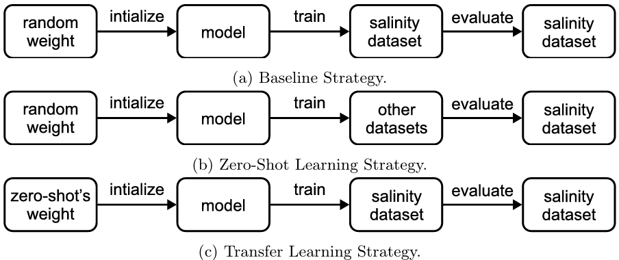

# Zero-Shot Learning for Salinity Forecasting (ICISN 2024)
This repo is the official Tensorflow implementation of [Zero-Shot Learning for Salinity Forecasting](https://doi.org/10.1007/978-981-97-5504-2_43)



### Usage
```
python .\train.py --dataConfigs="configs\datasets\salinity\salinity.yaml" --lag=128 --offset=32 --LTSF_NDLinearTime2VecRevIN__Tensorflow
```

```
python .\zeroshot.py
```
